## Advanced Lane Line Finding

---

**Advanced Lane Finding Project**

The goals / steps of this project are the following:

* Compute the camera calibration matrix and distortion coefficients given a set of chessboard images.
* Apply a distortion correction to raw images.
* Use color transforms, gradients, etc., to create a thresholded binary image.
* Apply a perspective transform to rectify binary image ("birds-eye view").
* Detect lane pixels and fit to find the lane boundary.
* Determine the curvature of the lane and vehicle position with respect to center.
* Warp the detected lane boundaries back onto the original image.
* Output visual display of the lane boundaries and numerical estimation of lane curvature and vehicle position.


## Camera Calibration

Camera calibration is performed by the code in the file camera_cal.py.  Camera calibration takes an array of object points, the actual 3D coordinates of points in space, and an array of image points, the locations where these physical points are mapped on the image plane.  Given many sets of these correspondences between object points and image points, the best fit transformation mapping object points to image points can be worked out.  

To do camera calibration, we need to use a physical object that has points that are easily identifiable, so that we can identify their location in the image.  To do this, a chessboard is often used, as the intersection points of the chessboard are easy to identify.  

As the chessboard is printed on a flat sheet of paper, all the intersection points lie in a plane.  We will set our world coordinate system so that this corresponds to the z = 0 plane.  In the actual case at hand, it looks like the chessboard image was affixed to the wall, thus the physical location of the chessboard was the same for each picture.  

It is interesting to note that we can assume that the z coordinate is always 0 even in the case where the camera is fixed and the chessboard is in a different location for each shot.  This is because all that matters is the relative position between the camera and the chessboard---we can always assume that one is fixed and determine the position of the other relative to this.

Here is an image from a nice [calibration tutorial](http://aishack.in/tutorials/calibrating-undistorting-opencv-oh-yeah/) that clearly illustrates this concept.

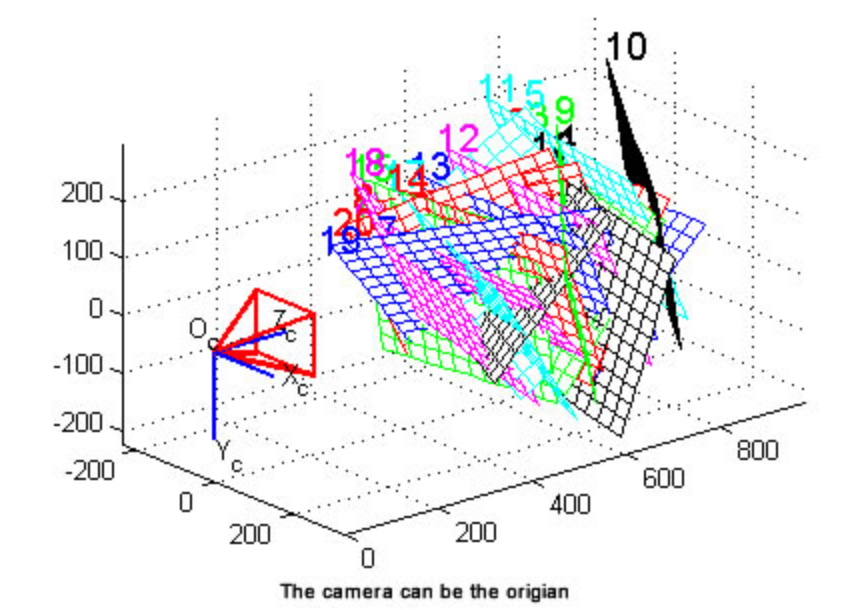
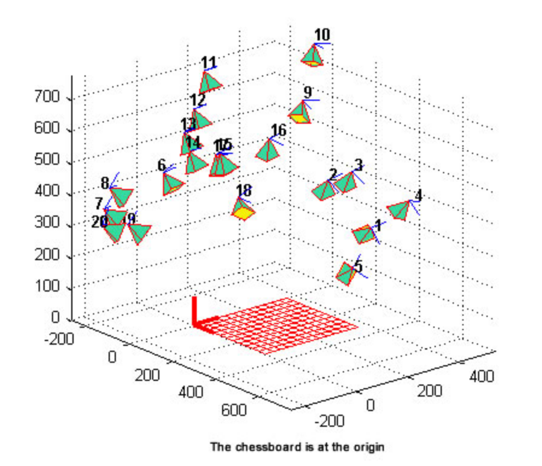

In most of the calibration images a 9-by-6 grid of chessboard intersection points was visible, but not all.  To cope with this, we wrote a function 
`create_grid(num_x,num_y,size_x = 1., size_y = 1.)` to generate an array of 3D coordinates of an arbitrary num_x-by-num_y grid of points with size_x spacing between x-coordinates and size_y spacing between y coordinates.

We found the pixel image coordinates of the chessboard intersection points using the cv2 findChessboardCorners function.  In practice we just looked for 9-by-6 and 9-by-5 grid sizes.  This worked for all but 2 calibration images, image 4 and 5.  This gave us 18 pairs of object point and image point vectors which was sufficient to find a good estimation of the camera mapping.

Estimating the camera mapping was done with the cv2 calibrateCamera function.  
This returns the intrinsic camera matrix mtx, the distortion coefficients dist, and also a list of rotation vectors rvecs and translation vectors tvecs that for each image gives the rotation and translation necessary to change from the given world coordinate system to a coordinate system with the camera at the origin.

After doing the camera calibration, we reprojected our object points using the found intrinisic camera matrix, distortion coefficients, rvecs, and tvecs and compared this to the actual image points.  Here is a plot of the reprojection error for each of the images used in calibration.

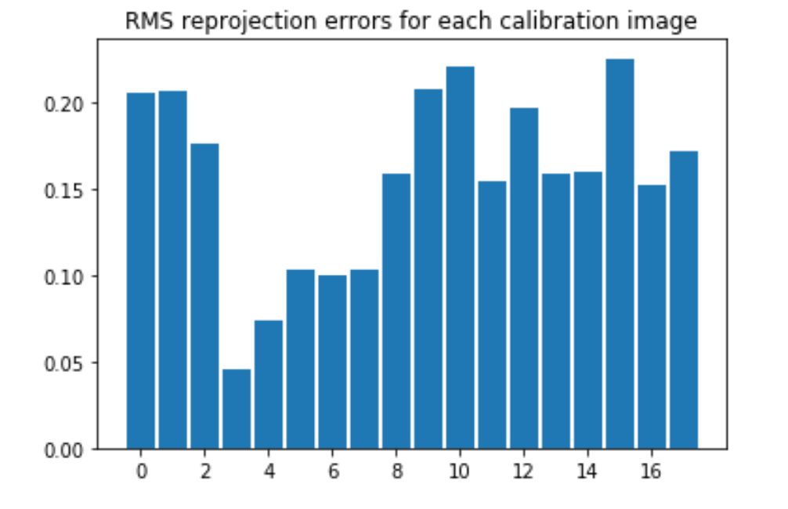

We see that for each image the RMS reprojection error is less half a pixel, so our calibration worked well.  

As a second check, we looked at the reprojection error on an image that we did not calibrate on, image 4.  Here the root mean square error was 0.2150
and the maximum pixel deviation was 2.2799.  Thus our camera calibration was fairly successful.


### Undistortion
We can use the found intrinsic camera matrix and distortion coefficients to undistort an image, that is correct for distortion caused by the camera lens.  Some barrel distortion was clearly visible in image 1, let's see how undistortion performs on this image.  The original image is on the left and the undistorted image on the right.

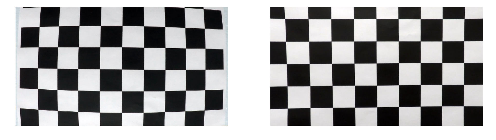

We see that the barrel distortion has been removed in the image on the right.

### Effect of scale on camera calibration
I was surprised that we were not told the exact size of the chessboard squares in the printout Udacity used to take the camera calibration images.  How does the size of the squares affect camera calibration?

To do the experiment, I did camera calibration again, but this time using the `create_grid` function to create object points whose spacing was 0.1 rather than 1.0.  Interestingly, the camera calibration with these object points returned exactly the same intrinsic camera matrix mtx, distortion coefficients dist, and set of rotation vectors rvecs.  The only change was to the set of translation vectors tvecs, and this vector was simply multiplied by 0.1.

As for the sequel of this project we only use the intrinisic camera matrix mtx and the distortion coefficients dist, a precise measurement of the size of the chessboard squares is not needed (as long as they are indeed perfect squares).

These results can be found in the jupyter notebook calibrate.ipynb.


## Pipeline (test images)

1) **Distortion correction.**  The first step in our lane line identification pipeline is to use the camera calibration we found earlier to undistort the lane line image.


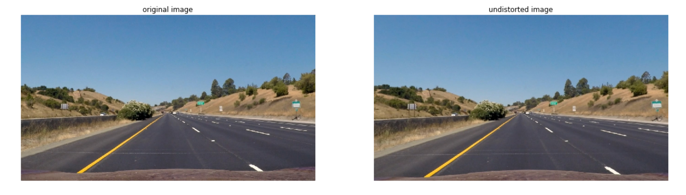

2) **Perspective Transformation.**  The next step in our pipeline was to determine a perspective transformation to convert our lane line image into a "bird's eye view" seeing the lane from above.  We used this image to determine our perspective transformation as the lines are straight.

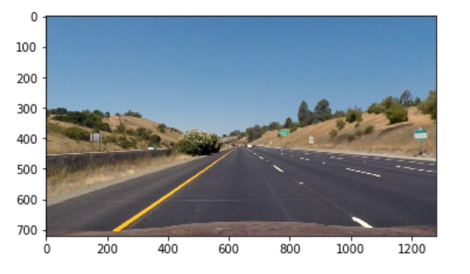

The basic idea is to choose 4 points in this image, two points on the left lane line and two points on the right lane line with corresponding y-values and map these four points to the corners of a rectangle.  For greater accuracy (and to try a new function) we used cv2's findHomography function rather than the getPerspectiveTransform function.  The findHomography function let's you choose any number of points in the source image and corresponding points in the destination image and finds a mapping between these sets of points.

The hardest part about this step is choosing the coordinates for the destination points.  We chose 7 points along the right lane line, and 7 corresponding points on the left yellow lane line, for 14 points in total.  We took points on the right lane line that were endpoints of the white lane stripes.  We did this so that we would have an idea where the destination points should go.  We used Gimp to choose these pixel values on the lane lines.

The distance between the lines at the bottom of the image is about 724 pixels.  By the US standard for lane width, this should correspond to 12 feet.  We also know that the length of lane stripes is 10 feet, and the distance between lane stripes is 30 feet.  Using this information, and keeping the scale of 724 pixels = 12 feet, we could precisely determine the location of the destination points.  

```
left_side = np.array([[290,661],[516,507],[538,491],[573,466],[580,461],[593,452],[597,449]],dtype = np.float32)
right_side = np.array([[1014,661],[774,507],[749,491],[710,466],[702,461],[687,452],[683,449]],dtype = np.float32)
src_big = np.vstack((left_side,right_side))
# pixels per foot
ppf = 724/12
left_dst = np.array([[290,120*ppf],[290,90*ppf],[290,80*ppf],[290,50*ppf],[290,40*ppf],[290,10*ppf],[290,0]],dtype = np.float32)
right_dst = np.array([[1014,120*ppf],[1014,90*ppf],[1014,80*ppf],[1014,50*ppf],[1014,40*ppf],[1014,10*ppf],[1014,0]],dtype = np.float32)
dst_big = np.vstack((left_dst,right_dst))
M_big = cv2.findHomography(src_big,dst_big)[0]
```

Here is the result of our perspective transformation, and a comparison of the two methods: using warpPerspective with 4 source and destination points, and using findHomography with 14 source and destination points.  They seem to give pretty similar results.

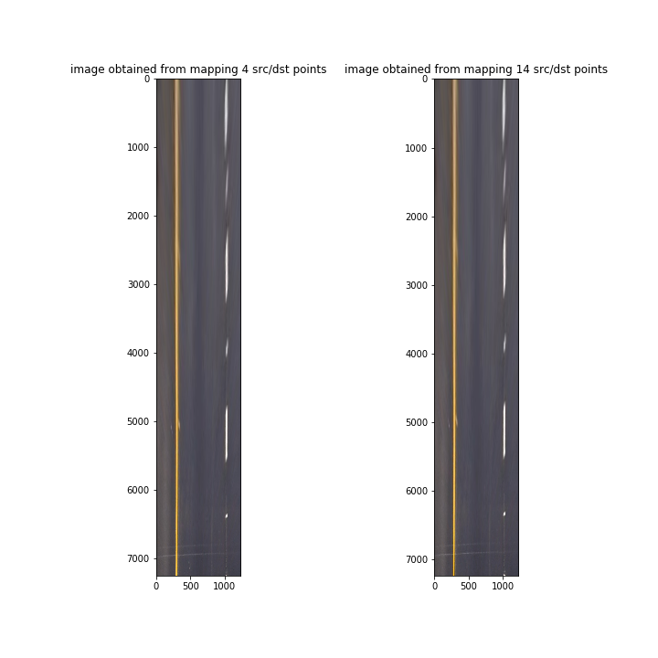

Notice that our images are quite long (over 7000 pixels) compared to the Udacity example images.  This is because we use the same scale of 724 pixels = 12 feet in both the x and y directions.  The extent of the image in the y direction is 120 feet, while in the x direction it is just over 12 feet.

Here is the result of the bird's eye transformation on all of the test images.

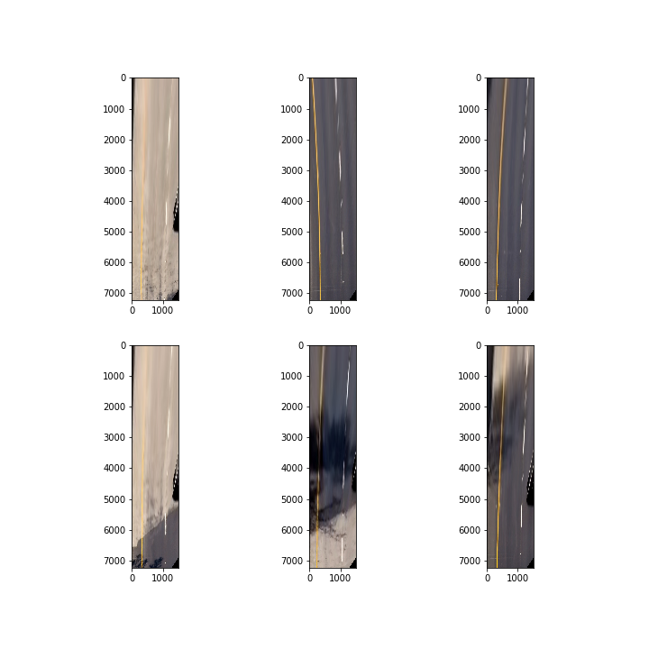

3) **Color channel selection.**

One way to identify lane lines under different lighting conditions--bright sunlight and shadows--is to transform to the HLS colorspace and look at the saturation channel.

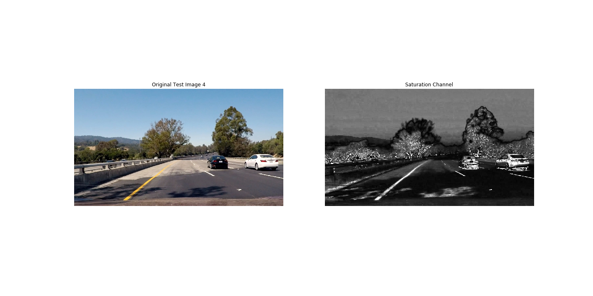

In this example, you can see that in the saturation channel, the left lane line remains visible even though part of it is in shadow.  

What is not nice about the saturation channel, however, is that the patch of shadow just in front of the car **also** has high saturation and appears as a white patch.  This white patch in the saturation channel causes difficulty in accurately picking up the location of the right lane line.  We would like to come up with a modified color transformation where the dark shadow does not become a white patch.

To see why this dark patch has high saturation, let's look at the definition of saturation.  Say that we start with an image [R,G,B] with red, green, and blue channels.  First we normalize these three channels to be scaled in [0,1]: let R' = R/255, G' = G/255, and B' = B/255.  Next let 
```Vmax = np.max([R',G',B'], axis=2)```
and ```Vmin = np.min([R',G',B'], axis=2)```.  The **chroma** C of the image is defined to be C = Vmax - Vmin.  The **lightness** L of the image is defined to be L = (1/2)(Vmax + Vmin).

With these definitions in place, we can now define the saturation S.  The formula for saturation depends on the lightness value.  For a pixel with L < 0.5 the saturation value is (255/2)C/L.  For a pixel with L >= 0.5, however, the saturation value is set to 255*C/(2-2L).

Now we can see what is happening.  Say we have a dark pixel, for example (0,0,1). For such a pixel we use the low lightness formula.  In this case, however, (Vmax - Vmin)/(Vmax+Vmin) = 1.  Thus the saturation of this pixel will be very large, 255!  This is not what we want for detecting lane lines.  

On the other hand, let's look at applying the high lightness formula to the pixel (0,0,1).  In this case, we get a value of 1, so this pixel will be dark.  This would be much better for detecting lane lines.  Let's look at the result in practice.

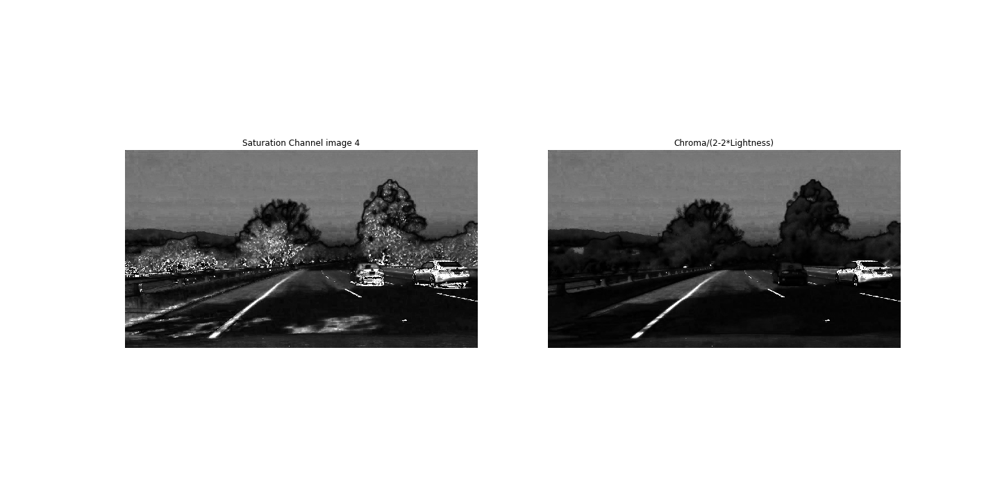

The result on the right looks much better!  Only using the high lightness part of the saturation formula gives high values for the lane lines because they are relatively bright.  At the same time it gives low values for dark pixels, thus we are not picking up any white patches from the shadow and the lane lines are easier to pick out.

4) **Thresholding**
After doing our color channel transformation to S = 255*C/(2-2L) we then threshold the transformed image with the following command.

```
ret,thresh = cv2.threshold(S,0,255,cv2.THRESH_BINARY+cv2.THRESH_OTSU)
```
This is an adaptive thresholding technique provided by cv2 that chooses the threshold to best cluster the pixel values into two classes.

```
ret,thresh = cv2.threshold(S2,0,255,cv2.THRESH_BINARY+cv2.THRESH_OTSU)
 ```
Here is an example of what this process gives, again comparing the same technique against the usual saturation channel.
 
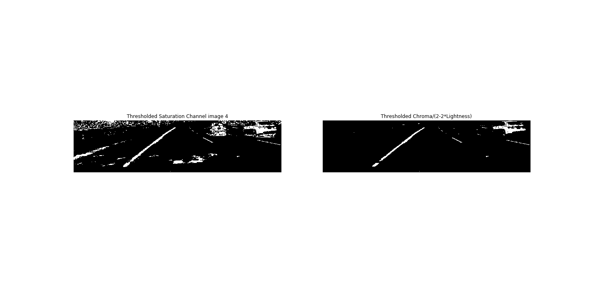

Finally, after thresholding we apply a median filter

```
thresh = cv2.medianBlur(thresh,3)

```

This helps to eliminate any stray white pixels that are not part of lane lines.

Here is the result of performing the color transformation and thresholding on all 6 test images.

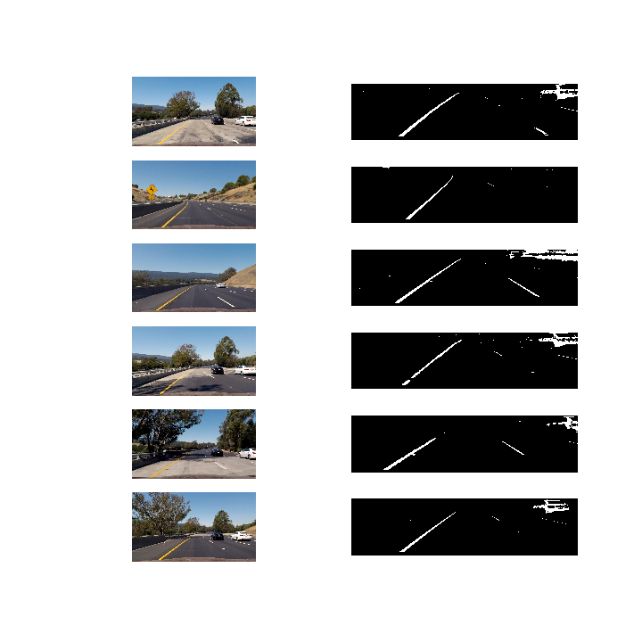

**Note: Order Matters** 
One could consider two different sequences of the above operations
Sequence A
1) Color Transformation
2) Cropping
3) Thresholding
4) Perspective Transformation

Sequence B
1) Perspective Transformation (in our case this also performs a cropping role)
2) Color Transform
3) Thresholding

Interestingly, these two sequences performed differently for us.  The main difference was in the lane lines far in the distance.  In the original image, these lines become very thin and this makes them harder to detect in sequence A.  The perspective transform tends to make lines in the distance somewhat diffuse and elongated.  We found that because of this sequence B resulted in fatter lines.

In the final video project, we ended up using Sequence A for the solid left hand lane, and sequence B for the right hand lane.  This is because we picked up the left hand lane very well, and doing sequence B resulted in a fat line for which our pipeline was not set up to find the middle.  

For the striped right hand lane, however, we were getting quite a weak signal.  Doing the perspective transform first in Sequence B helped to amplify this signal.

**Other techniques**

We experimented quite a bit with other processing techniques discussed in the Udacity notes, like taking Sobel gradients in the x and y directions, and thresholding on the direction and magnitude of the gradient.  While we could pick out lane lines by combining these techniques, the signal seemed to be weaker than just thresholding on our color transformed channel.  Thus, at the end, we just went with this transformation.  

5) **Fitting lane lines**

The basic idea of our lane line fitting procedure is as follows.  We worked on the bird's eye view image, which has 7240 rows and 1500 columns.  We divided the image into 1000 horizontal blocks and looked at the column sums in each of these horizontal blocks.  This can be accomplished by a matrix multiplication:

```
F = np.zeros(shape = (num_windows, bird.shape[0]))
    for i in range(num_windows):
        F[i,int(i*window_size):int((i+1)*window_size)]= 1/window_size
proj = np.dot(F,bird)

```
We then split `proj` into its left half and right half, and took the argmax of each row.  This gave us candidate x-coordinates for the postions of the left and right lane lines.  We threw out any all-zero rows, and fit a polynomial on the remaining (x,y) coordinates.


```
maxes = np.argmax(proj,1)
indices = np.where(maxes > 0)[0]
y_nonzero = y[indices]
x_nonzero = maxes[indices]
p = np.polyfit(y_nonzero, x_nonzero,2)

```

6) **Computing the radius of curvature**

At this stage, we have computed a polynomial p that fits the lane lines in pixel coordinates.  We want to compute radius of curvature, however, in meters.  Luckily, because we used the same meters-to-pixel scale in both the x and y directions, the transformation is very simple.

```
# meters per pixel (12 feet = 724 pixels, 1 meter = 3.28 feet)
mpp = 12/(724*3.28)
roc_meters = roc_pixels * mpp
```

Thus our computation of the radius of curvature in meters looks as follows.
We computed the radius of curvature at a point at the bottom of the image, close to the car.

```
roc = mpp * (1+(2*p[0]*bird_shape[1] + p[1])**2)**(3/2) / np.abs(2*p[0])

```

We calculated the radius of curvature for both the right and left lane lines and reported the average of these.

**Lane Offset**
We assume that the camera is mounted in the middle of the car.  As the images are 1280 pixels wide, we assume that the x-coordinate center of the car is at pixel 640.  In the bird's eye view transformation, the point (640,720) is mapped to the point (636,7246).  We look at the x-coordinate of the fitted left and right lane lines at y value about 7240.  Call these values l and r.  We then look at the distance from the midpoint 636 to l and subtract from it the distance from 636 to r.  Finally we multiply by the meters per pixel scale factor to obtain our final offset value.


```
# x coordinate center of bird image is at 636
offset = (2*636 - (left_bottom + right_bottom))*mpp
```

7) **Drawing the fitted lane lines**

Given the fitting polynomial, created arrays of the predicted (x,y) points of the lane lines.  We then drew the predicted lane line points with the cv2 function fillPoly onto a blank image of the same size as the bird's eye view. This image was then transformed back into the normal camera view using the inverse of our perspective transformation matrix.  Finally, the lane line region was overlayed onto the undistorted original image using the cv2 addWeighted function.  Here are some examples of the final result:

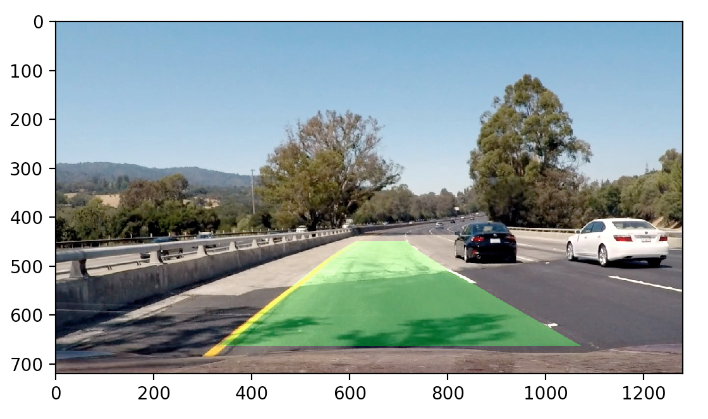

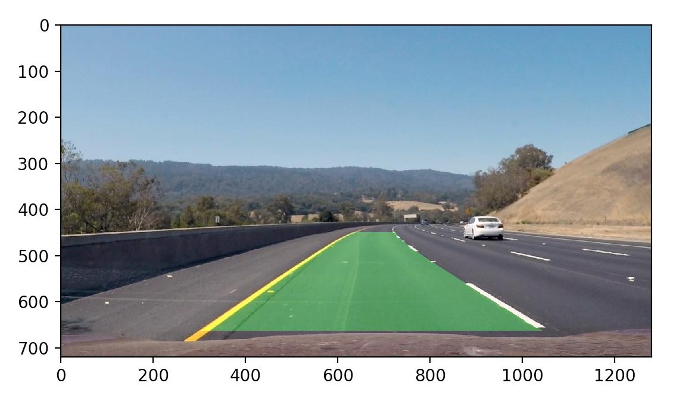


### Pipeline (video)

#### 1. Provide a link to your final video output.  Your pipeline should perform reasonably well on the entire project video (wobbly lines are ok but no catastrophic failures that would cause the car to drive off the road!).

Here's a [link to my video result](./project_annotated.mp4).  The program used to create this video is pipeline_movie.py.

We had to modify our pipeline to work well on the video.  With the original pipeline we developed for individual images, the detection of the right striped line in the video was not very consistent, especially when there was not a stripe at the bottom of the image close to the car.

To improve the detection of the striped line, we did the following.  We first generated a fit to the right line, which we were able to consistently pick up.  We then searched for the bottom of the right hand line.  If we could not find the bottom of the right hand lane, we assumed it's x-coordinate was 724 (the approximate lane width) plus the bottom of the left hand lane.

We then used the fit of the left hand lane to create a "tube" around the expected position of the right hand lane.  We created a mask to zero out the image outside of this tube.  Within this tube, we did a hls transform and looked at the lightness channel L.  We then did a hard threshold to zero out pixels whose L value was less than 200.  This process picked up more of the white striped line, especially in the distance, than our modified saturation color transform described earlier.  

We this modification we were able to detect both the left and right lane lines quite well in almost every individual frame, and no averaging over previous frames was needed.

---

### Discussion

1) There are some parameters that are hard coded in the current program.  For example, in the detection of the right lane line we look for it inside a "tube" that is 500 pixels wide.  We had to make it this wide because sometimes the left and right lanes were not exactly parallel in the perspective transformed image.  However, if we made the tube wider, it might start to pick up unwanted pixels, like from cars in the next lane.

2) The current program is quite tuned to project video.  We knew that we could reliably detect the left solid line, so we used this fact to help us detect the more tricky striped line.  A more robust program would have to evaluate the initial detection of each line.  If one detection was good and the other poor, it could then use the good detection to try to help to improve the detection of the other lane.

3) Noise reduction.  Luckily combination of the color transformation and perspective transformation in our current pipeline is pretty good at eliminating stray pixels that are not part of the lane lines.  Still, a more robust program would have to do checks to evaluate detected pixels and determine if they are plausibly part of the lane lines.

4) Speed.  Our initial version of the pipeline processed the project_video in 15 minutes.  When we modified the program to more robustly detect the right striped line, the running time went up to 25 minutes.  A real implementation would have to improve the speed of evaluating each individual image.  We have not tried to optimize this here.
